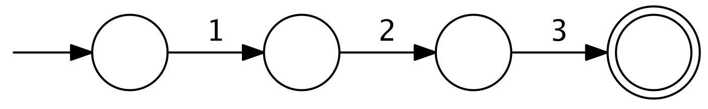
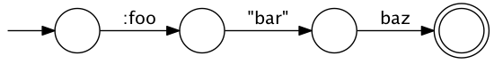
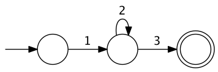
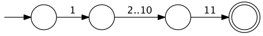
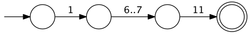
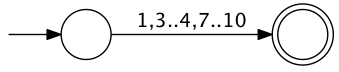
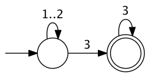
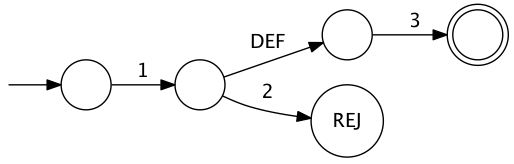
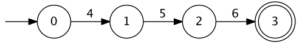
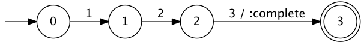

Automat is a library for defining and using finite-state automata, inspired by [Ragel](http://www.complang.org/ragel/).  However, instead of defining a DSL, it allows them to be built using simple composition of functions.

These automata, once compiled, are quite fast.  An array with 100 million elements can be processed in 500ms, giving a mean transition time of 5ns.  However, Automat isn't just for high throughput use cases; it's meant to be useful wherever an FSM is necessary.

```clj
[automat "0.1.0"]
```

Full documentation can be found [here](http://ideolalia.com/automat).

### defining an FSM

A [finite-state machine](http://en.wikipedia.org/wiki/Finite-state_machine) or finite-state automaton is defined as a series of states and transitions between these states, driven by a sequence of inputs. The automaton begins at a **start state**, and proceeds through the transitions until it reaches an **accept state**.  If given an input that isn't a valid transition, the automaton may either reject the input sequence or reset to the beginning, depending on the use case.

In Automat, the simplest automaton is simply a vector representing a chain of valid inputs.

```clj
> (require '[automat.viz :refer (view)])
nil
> (require '[automat.core :as a])
nil
> (view [1 2 3])
```



The circle on the left is the start state, and the circle on the right with the double-lined border is the accept state.  Note that the transitions don't have to be numbers:

```clj
> (view [:foo "bar" 'baz])
```



Each argument to `fsm` can either be an input or another automaton.

```clj
> (view [1 [2 [3]]])
```


Note that this is identical to the first automaton.  If you want to consume inputs which are vectors without them being flattened, they can be represented as lists:

```clj
> (view [1 '(2 (3))])
```


We can also combine existing automatons using the operators in `automat.core`:

```clj
> (view (a/or [1 2 3] [1 3]))
```



This represents the **union** of the two automata, and returns an automaton which will either accept `1, 2, 3` or `1, 3`.

If we want to accept a range of inputs, we can use `..`:

```clj
> (view [1 (a/.. 2 10) 11])
```



This will accept `1, 2, 11`, `1, 3, 11`, and so on.  If we subsequently want to narrow this, we can use `and`:

```clj
> (view
    (a/and
      [1 (a/.. 2 7) 11]
      [1 (a/.. 6 12) 11]))
```



This represents the **intersection** of two automata, in this case giving us an automaton that either accepts `1, 6, 11` or `1, 7, 11`.  Note that if the intersection is empty, this will give us an automaton that cannot accept anything.

```clj
> (view (a/difference (a/.. 1 10) 2 (a/.. 5 6)))
```



This represents the **difference** between the automata, in this case an automata that accepts `[1,10]`, less the inputs `2, 5, 6`.

The operators `*`, `+`, and `?` behave as they do in regular expressions:

```clj
> (view [(a/? 1) (a/* 2) (a/+ 3)])
```

This gives us an automaton that accepts zero or one `1` inputs, zero or more `2` inputs, and one or more `3` inputs.



The `not` operator is equivalent to the regex `^` flag for negating character classes:

```clj
> (view [1 (a/not 2) 3])
```



In this diagram, `DEF` represents the default transition (in this case, anything but `2`), and `REJ` represents a rejection state.  The `DEF` transition will consume the input, but the transition to the `REJ` state will not.

### using an FSM

Once we've defined an FSM, we can `compile` it:

```clj
(a/compile [1 2 3])
```

This will optimize the FSM, emit code that processes it, and call `eval` on it.  The resulting compiled FSM can be interacted with via `advance`, `find`, `greedy-find`.  These operations are pure, and can be safely called on multiple threads.

Notice that when we visualize a compiled FSM, the states themselves are now labeled:

```clj
> (view (a/compile [4 5 6]))
```



The simplest way to interact with a compiled FSM is `(advance fsm state input)`.  It takes a `state`, which will be discussed later, and a single input.

```clj
> (def f (a/compile [1 2 3]))
#'f
> (a/advance f nil 1)
{:accepted? false
 :checkpoint nil
 :state-index 1
 :start-index 0
 :stream-index 1
 :value nil}
```

This returns a map representing the FSM state produced by the input.

| field | description |
|-------|-------------|
| `accepted?` | whether the FSM is at an accept state |
| `state-index` | the numeric identifier for the current FSM state, as shown by `view` |
| `start-index` | the stream index where the FSM last (re)started |
| `stream-index` | the current stream index |
| `checkpoint` | the previous match, only non-nil when used with `greedy-find` |
| `value` | the current reduce value, explained below |

This map can be passed back into `advance` as the `state` parameter:

```clj
> (def adv (partial a/advance f))
#'adv
> (-> nil (adv 1) (adv 2) (adv 3))
{:accepted? true
 :checkpoint nil
 :state-index 3
 :start-index 0
 :stream-index 3
 :value nil}
```

Notice that `advance` either accepts the map descriptor returned by a previous call to `advance`, or an arbitrary value, representing an initial value at the beginning of the FSM.  The reasons for this are shown below.

If we pass an input into `advance` that isn't accepted by the FSM, it will throw an exception.  Alternately, we can pass an additional field into advance specifying what it should return if the input is rejected:

```clj
> (a/advance f nil 42)
IllegalArgumentException
> (a/advance f nil 42 :error)
:error
```

Normal finite-state automata are represented *only* by the `state-index`.  The additional fields give us some additional capabilities; of special interest is the `value` field, which allows us to treat the FSM as a pattern-matching reduction over a stream of values.

We can define reduction operations within our FSM using the `$` function:

```clj
> (def f (a/compile
           [1 2 3 (a/$ :complete)]
           {:reducers {:complete (fn [state input] :complete)}})))
#'f
> (view f)
```



As shown here, the `:complete` action is something that's associated with the previous input, in this case `3`.  Then, when calling `compile`, we associate a reduce function with that action, which takes the current reduce `:value` and the latest input.  In this case, it simply returns :complete when it gets the sequence `[1 2 3]`.

```clj
> (def adv (partial a/advance f))
#'adv
> (-> :incomplete (adv 1) (adv 2) :value)
:incomplete
> (-> :incomplete (adv 1) (adv 2) (adv 3) :value)
:complete
```

While this is a fairly trivial application, there are a wide variety of ways this can be used.  For instance, this means that unlike a normal automaton, we can tell whether a list of parentheses are balanced, by tracking the number of un-closed parens in our `:value`.

### a short example

For a more real-world use case, consider tracking browsing behavior on an online store.  We want to see when the customer visits the cart, begins to checkout, but then returns back to the cart without having completed the checkout.  Seeing this indecisive behavior, we can make a special offer.

This means that we want to track this pattern:

```clj
[:cart :checkout :cart]
```

However, the user may wander around a bit, so we want to allow for arbitrary pages in between:

```clj
> (def pages [:cart :checkout :cart])
#'pages
> (def page-pattern
    (vec
      (interpose (a/* a/any) pages)))
#'page-pattern
> (view page-pattern)
```


Here we've interposed `(a/* a/any)` between each transition, which will happily accept zero or more pages that don't match the expected pattern.  However, the data that represents our pages is likely more complicated than just a keyword.  Likely it will be a map describing the URL, the page contents, and so on.

In this case, we want to define the `:signal` when compiling the FSM, which is a function that takes the raw input, and returns the signal that will actually be matched on.  In this case, let's assume that each pageview is represented by a map with a `:page-type` field that will contain `:cart`, `:checkout`, and others.  Let's also assume that we want to keep track of the full data for the cart and checkout pages.

This is all fairly straightforward:

```clj
> (def page-pattern
    (->> [:cart :checkout :cart]
         (map #(vector [% (a/$ :save)]))
         (interpose (a/* a/any))
         vec))
#'page-pattern

> (def f
    (a/compile

      [(a/$ :init)
       page-pattern
       (a/$ :offer)]

      {:signal :page-type
       :reducers {:init (fn [m _] (assoc m :offer-pages []))
                  :save (fn [m page] (update-in m [:offer-pages] conj page))
                  :offer (fn [m _] (assoc m :offer? true))}}))
#'f
> (view f)
```


First, we take each of the notable pages and add a `:save` action to them.  Then we interpose the wildcard matcher to each.  Then we define reducer functions that saves the full page data under `:offer-pages`, and sets `:offer?` to true if we continue through the whole process.

Notice that the first action doesn't have an associated input, it simply happens upon entering the FSM.  Notice too that the final input has two associated actions.  This is perfectly safe, but the order in which the actions occur is not well-defined, so they should always be indepenent of each other.  If the same action is defined twice on a given transition, it will only be performed once.

This is a fairly verbose way to define simple behavior, but it's worth noting that almost everything exception for the `[:cart :checkout :cart]` sequence can be abstracted away.  With the proper domain-specific scaffolding, this can be a powerful declarative mechanism.

It's also easy to extend.  Let's say that we want to save any `:product` pages the user visits, to better inform our offer.  This is a fairly small modification:

```clj
> (view
    (->> [:cart :checkout :cart]
         (map #(vector [% (a/$ :save)]))
         (interpose
           (a/*
             (a/or
               [:product (a/$ :save)]
               a/any)))
         vec))
```


As our desired behavior gets more complicated, they can still be defined as small, composable pieces of behavior.

### searching over streams

`find` works similarly to regex matching.  It takes the stream of inputs, which can be a byte-array, `java.nio.Buffer`, `java.io.InputStream`, `java.io.Reader`, or a normal Clojure sequence. The inputs in the FSM correspond to elements from these streams, which will be consumed until an accept state is reached, or the end of the stream is reached.  In either case, `find` will return a new state.

If a match is found, `accepted?` will be true, `start-index` will be the point within the stream where the match begins, and `stream-index` will be the point where the match ends.

```clj
> (a/find f nil [1 2 3])
{:accepted? true, :checkpoint nil, :state-index 3, :start-index 0, :stream-index 3, :value nil}
```

If `accepted?` is false, the `start-index` will describe where the FSM last restarted.  This state can be passed into `find` with a new stream of inputs.

```clj
> (a/find f nil [1 2 1 2])
{:accepted? false, :checkpoint nil, :state-index 2, :start-index 2, :stream-index 4, :value nil)}
```

In either case, `state-index` will describe where we are in the actual compiled automaton.  This can be correlated by calling `automat.viz/view` on a compiled FSM.

When defining patterns that are subsets of each other, such as `(or [1 2] [1 2 3])`, `find` will always return upon matching the shortest of the two.  If we want to match on the longest, we can use `greedy-find` instead.  Note that `greedy-find` will always consume at least one more input than it needs for the match, which means that reduce actions used with it must not have side effects.

When using `$` for accumulation tasks with `find` or `greedy-find`, it can be tedious to place an accumulation reduce function in between every transition.  In these cases, we can simply use `interpose-$`:

```clj
> (def f
    (a/compile
      [($:clear) (a/interpose-$ :conj (range 5))]
      {:clear (constantly [])
       :conj conj}))
#'f
> (a/find f (a/start f nil) (range 5))
{:accepted? true, :checkpoint nil, :state-index 5, :start-index 0, :stream-index 5, :value [0 1 2 3 4]}
```

Using `$` can be a powerful tool, but it will have a performance impact - for high throughput use cases prefer using the `:start-index` and `:stream-index` values to pull out the input data in bulk.

### license

Copyright © 2014 Zachary Tellman

Distributed under the MIT License
